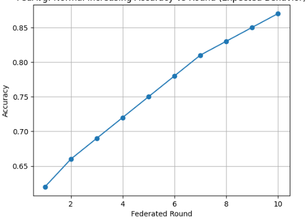

# Federated Learning with Data Poisoning (Label Flip Attack)

This repository demonstrates **Federated Learning (FL)** using the **Flower framework** on an **IoT Anomaly Detection Dataset**, including the impact of **label flipping data poisoning attacks** by malicious clients.

---

## Project Overview

- Framework: **Flower (flwr)**
- Backend: **PyTorch**
- Learning Type: **Federated Learning (FedAvg)**
- Attack Type: **Label Flip Attack**
- Use Case: **IoT Anomaly Detection**

Each IoT device acts as an independent federated client.

---

## Dataset Structure

```text
Anomaly Detection Dataset/
├── Danmini_Doorbell/
├── Ecobee_Thermostat/
├── Philips_B120N10_Baby_Monitor/
├── Provision_PT_737E_Security_Camera/
└── Provision_PT_838_Security_Camera/
Each folder represents one federated client with its own private local data.
```
## Federated Learning Configuration
Number of Clients: 5  

Malicious Clients: 2  

Aggregation Algorithm: FedAvg  

Training Rounds: 10  

Evaluation Metric: Accuracy  

## Data Poisoning (Label Flip Attack)  

Malicious clients intentionally corrupt labels during training:  

y = (y + 1) % num_classes  
This degrades the global model’s performance after aggregation.  

## Project Structure  
```text
.
├── client.py        # Flower client logic
├── server.py        # Federated server + FedAvg
├── model.py         # Neural network model
├── dataset.py       # Client-wise data loading
├── utils.py         # Train & test functions
├── requirements.txt
└── README.md
```
## How to Run  
Install dependencies  

pip install flwr torch torchvision matplotlib 

Start federated simulation

python server.py

Output : Accuracy vs Federated Rounds plot

Initially, model will train normaly on dataset as poisoned = False (default)

To Poison 2 (custom) of the client set poisoned = True on server.pynb




## Expected Behavior
No attack: Accuracy steadily increases

With attack: Accuracy fluctuates or degrades

## Research Motivation
This project helps understand:

Security risks in Federated Learning

Effects of poisoned clients on global models

Why robust aggregation is needed


